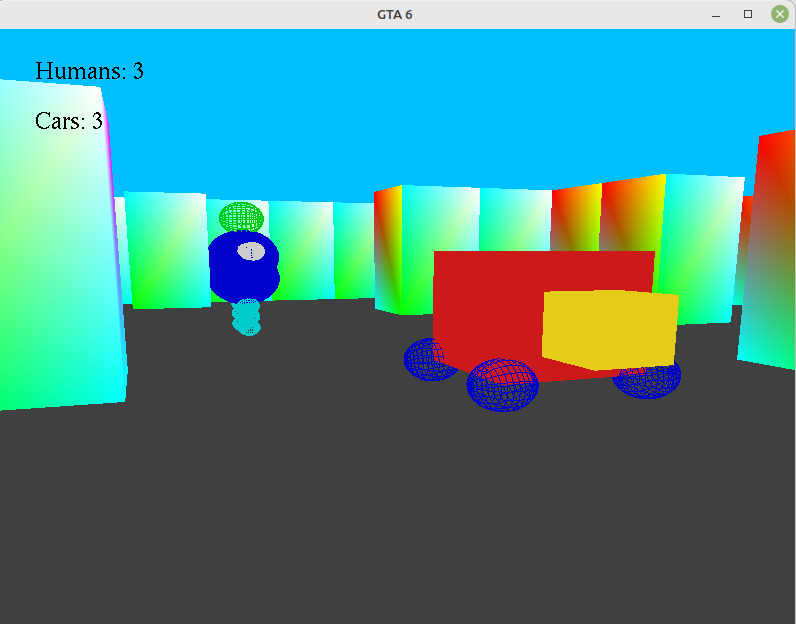

### Unit of Study: Synthèse et Analyse d'Images

### Project Description

This project is a 3D game built using the OpenGL library, where players navigate through a labyrinth environment. The goal is to find the "aim" (which can be a torus, teapot, cube, etc.) to win the game. As the player moves through the maze, they will encounter moving cars and humans. If the player collides with a car or a moving human, they will lose the game.

### Instructions

1. Go to the `3DGame` folder.
2. Enter the `make` command.
3. Run `./game`.

### Movement Controls

- **W**: Move backward
- **S**: Move forward
- **A**: Move left
- **D**: Move right
- **Mouse**: Look around; holding any movement key while moving the mouse will continue to move in that direction.

### Dependencies

To run this project, you will need the following libraries:

- **OpenGL**: Used for rendering the 3D graphics.

